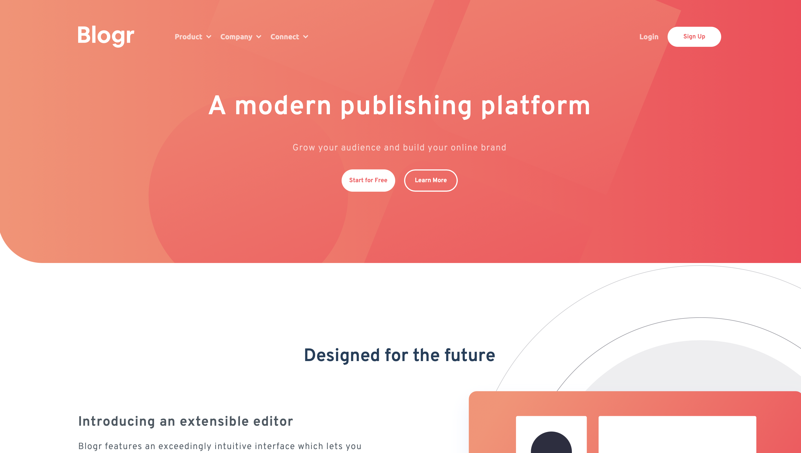
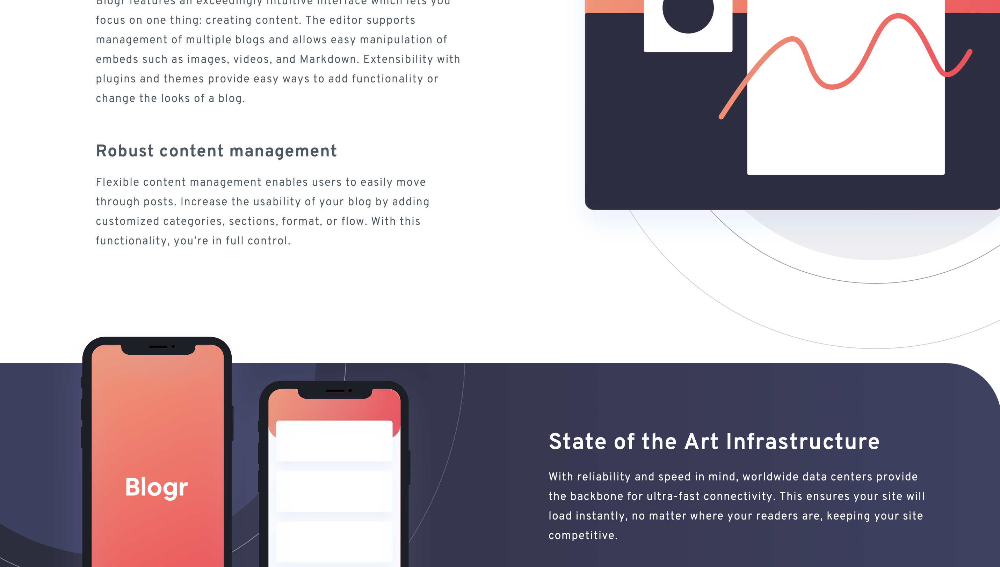
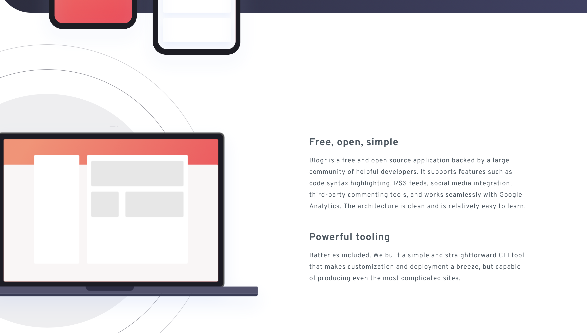
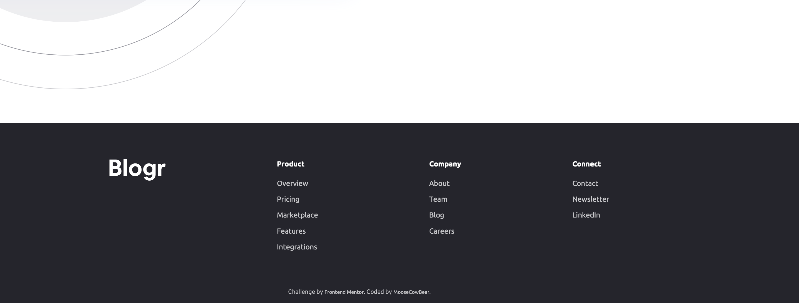

# Frontend Mentor - Blogr landing page solution

This is a solution to the [Blogr landing page challenge on Frontend Mentor](https://www.frontendmentor.io/challenges/blogr-landing-page-EX2RLAApP).

## The challenge

Users should be able to:

- View the optimal layout for the site depending on their device's screen size
- See hover states for all interactive elements on the page

## Screenshots

## Links

- [Solution](https://github.com/MooseCowBear/frontend-mentor-blogr-landing-page)
- [Live](https://moosecowbear.github.io/frontend-mentor-blogr-landing-page)

## Built with

- CSS custom properties
- CSS Grid
- Flexbox

## Author

- GitHub - [MooseCowBear](https://github.com/MooseCowBear)
- Frontend Mentor - [@MooseCowBear](https://www.frontendmentor.io/profile/MooseCowBear)